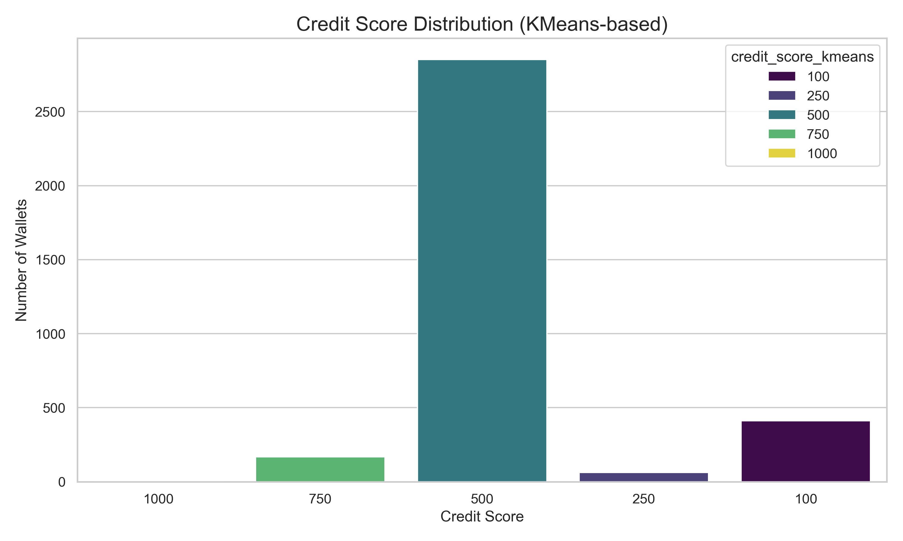

# Wallet Credit Score Analysis

After processing all wallet transactions, the KMeans clustering algorithm was used to assign a **Credit Score** to each wallet. The scores range from **100 (low creditworthiness)** to **1000 (high creditworthiness)**.

## Cluster-wise Credit Score Summary

Wallets are grouped into the following score ranges:

| Cluster | Credit Score | Wallet Count |
|---------|--------------|---------------|
|   0     |     500      |     2853      |
|   1     |     750      |      169      |
|   2     |    1000      |        2      |
|   3     |     250      |       62      |
|   4     |     100      |      411      |

**Visualization**: The bar chart `credit_score_distribution.png` clearly shows that most wallets fall into the mid-range score of 500 
 

## Behavioral Insights by Score Range
### Score: 100 (Cluster 5)
- High number of liquidation calls
- Low deposit and repay activity
- Risky or non-reliable wallet
### Score: 250 (Cluster 4)
- Slight improvement over the lowest tier
- Still below average in net position and repay history
### Score: 1000 (Cluster 3)
- Very few wallets (2 in sample)
- High repay and deposit volume
- Zero or negligible liquidation
- Highly trustworthy wallets
### Score: 500 (Cluster 1)
- Majority of wallets
- Balanced but not outstanding behavior
- Moderate deposit and borrow actions
### Score: 750 (Cluster 2)
- Good net position and low liquidation
- Active users with responsible repayment behavior

## Conclusion

This clustering-based scoring approach provides a transparent and interpretable way to evaluate wallet behavior on Aave V2. The results suggest that while the majority of wallets are average users, a minority show clear risk patterns or very strong reliability.

